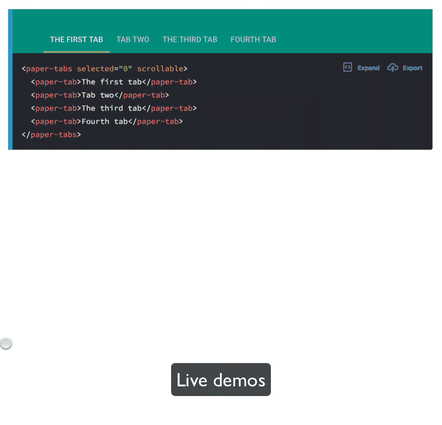
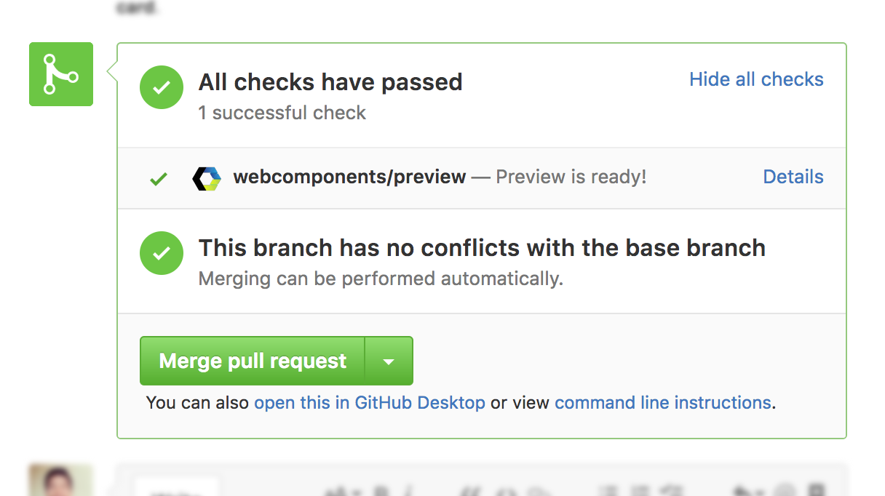

  

With a growing web components community creating high quality components, we are excited to __announce the new [webcomponents.org](https://www.webcomponents.org) including a new custom element registry__.

The next generation of Web Components are here, thanks to cross-browser collaboration:
 * Chrome supports [Shadow DOM v1 in Chrome 53](https://www.chromestatus.com/feature/4667415417847808) and [Custom Elements v1 in Chrome 54](https://www.chromestatus.com/feature/4696261944934400).
 * Safari shipped support for [Shadow DOM v1 in Safari 10](https://webkit.org/status/#feature-shadow-dom), and [Custom Elements v1 in Safari Technology Preview](https://webkit.org/blog/7027/introducing-custom-elements/).
 * Firefox is actively developing [Shadow DOM](https://platform-status.mozilla.org/#shadow-dom) and [Custom Elements](https://platform-status.mozilla.org/#custom-elements).
 * Edge has placed [Shadow DOM as high priority](https://developer.microsoft.com/en-us/microsoft-edge/platform/status/shadowdom/) and [Custom Elements as medium priority](https://developer.microsoft.com/en-us/microsoft-edge/platform/status/customelements/) on their roadmap.

[Polyfills are available](https://www.webcomponents.org/polyfills) for all major browsers with several libraries building on top of these including [Polymer](https://www.polymer-project.org/1.0/), [SkateJS](https://github.com/skatejs/skatejs) and [X-Tag](https://x-tag.github.io/).

The new custom element registry makes it easy to find web components built by other developers to use in your application, and share open-source web components you’ve built with the community.

# Features
 * __Live, editable inline demos__ - Element pages can include inline demos that let you see and play with elements before you use them.

  

 * __API documentation__ - Detailed documentation on attributes, properties and methods on custom elements are shown where possible.
 * __Latest and greatest__ - The element registry automatically pulls new tagged releases from GitHub as they're published, ensuring documentation is always up to date.
 * __Collections__ - Collections enable the community to organize elements to help you discover more elements.
 * __Verified open source__ - The registry only accepts elements under licenses approved by the [Open Source Initiative](https://opensource.org/) so you can can freely use any element.

# Element author features
 * [__Element preview__](https://beta.webcomponents.org/preview) allows you to see how an element will appear without publishing it. Works with any pull request, branch, or commit on GitHub.

  

 * [__GitHub preview integration__](https://beta.webcomponents.org/preview-integration) assists development by allowing you to see the effects of a pull request on demos & documentation.

  

# Getting started
 * New to web components? [Read our introduction to learn more.](https://www.webcomponents.org/introduction)
 * Discover elements. [Browse the element registry.](https://www.webcomponents.org/)

# How to contribute
 * [Publish](https://beta.webcomponents.org/publish) your custom elements
 * Contribute to the [development of the site](https://github.com/webcomponents/beta) by filing issues and sending pull requests
 * Curate and review elements by [publishing a collection](https://beta.webcomponents.org/publish-collection)
 * [Join the Gitter chat](https://gitter.im/webcomponents/community)

# Future
Web components are most useful when there's a strong community sharing ideas, components and supporting each other. We look forward to seeing the best from the web components community!
